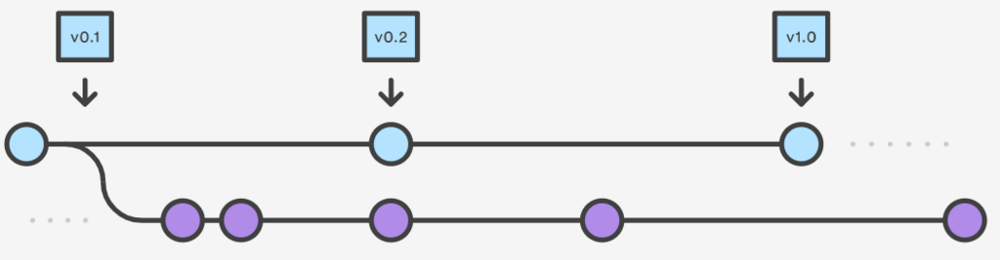

# Лекція 1. Інструменти розробника та робоче середовище

---

## Linux та автоматизація системи

### Файлова система

1. абсолютний шлях: `/path/to/file`
2. відносний шлях: `path/to/file`
3. скорочення: `.`, `..`

#### Приклад

1. `/app/to/src`
2. `/app/to/src/../to_file_in_src`

### Консольні команди та основи sh

#### Основні команди

1. `man`, `info`, `--help`
2. `cd`, `mkdir`, `ls`
3. `cat`, `less`,
4. `sed`, `sort`
5. `grep`, `find`
6. `cp`, `mv`, `rm`
7. `touch`, `truncate`
8. `chmod`, `chown`
9. `pwd`, `env`, `ps`, `top`
10. `echo`, `printf`, `tee`, `<<< HERE_DOC`
11. `read`, `|` - pipe, пайп
12. `test`, `[]`, `if then else fi`,
13. `&&`, `||`, `:`
14. `for .. do ..done`, `while ... do ... done `
15. `function () {}`, `alias`
16. `'text'`, `"text with '${arg}'"`
17. `declare`, `local`
18. `VAR="value"`
19. `VAR_A=("value1" "value2")`
20. \`cmd\`

#### Основні змінні системи

- `$?` - Код виходу
    - `0` - завершення з успіхом
    - `1` - завершення з помилкою
- `$HOME` - шлях до домашнього каталогу поточного користувача
- `$PWD` - поточний шлях
- `$USER` - ім'я поточного юзера
- `1>`, `2>`, `<` - дескриптори `stdout`, `stderr`, `stdin`
- `$0`, `$#`, `$1`, `$2`..., - вхідні параметри

#### Приклади використання команд

##### Використання команд

```bash
cd "$HOME"
echo "$PWD"
mkdir testproj; cd testproj
[ -e "testfile.txt" ] || touch testfile.txt
echo "line 1" >> testfile.txt
[ -f "testfile.txt" ] && cat testfile.txt | tee "log"
printf "%s" "line 1" | tee -a testfile.txt
cat testfile.txt
ls -la1 .
truncate -s0 testfile.txt
ls -la1 .
VAR=1; echo "VAR=${VAR}"
VAR_A=(1 2 3)
echo "len VAR_A=${#VAR_A[@]}"
for v in "${VAR_A[@]}"; do echo "$v"; done
```

#### Приклад найпростішого скрипта

```bash 
#!/usr/bin/bash
# Перша строчка має назву: shebang (шебенг)
# Використовується для файлів, що мають права на виконання
   
set -u;
set -x;

t=$1

_main () {
	local a=$1;
	if [ "$a" != 0 ]; then
		echo "$a"
	else
		echo "empty"
	fi
}

############################

_main 2
}
```

#### Приклад з реального скрипта

```bash
FN_HEADER="header.md"
FN_FOOTER="footer.md"
FN_LINKS="links.md"
FN_RESULT="README.md"

FN_MASK=""
FN_L='l'
FN_P='p'

RESULT="${DN_BUILD}/${FN_RESULT}"

_strip() {
    echo "$1" | sed -e 's/^[[:space:]]*//; s/[[:space:]]*$//'
}

_strip_h() {
    local line=$1
    line=$(echo "$line" | sed -e 's/^#*//')
    _strip "$line"
}
```

### Основи git

#### Flow



#### Основні команди

- git init/clone
- git status
- git checkout
- git branch
- git add
- git commit
- git merge/rebase
- git diff
- git log
- git revert
- git reset
- git reflog

#### Workflow розробки кода

1. git init/clone/fetch
2. git checkout [-b] 'feature_branch_name'
3. git rebase "main_branch"
4. ```... resolve conflict if present ...```
5. ```... edit files ...```
6. git status
7. git add
8. git commit -m 'mess'
9. git push

#### Приклад застосування bash для pre-push hook

- Hook `.git/hooks/pre-push`

```
#!/bin/bash
#set -x

protected_branch=(
master
main
)

# Argument parsing taken from .git/hooks/pre-push.sample
while read local_ref local_sha remote_ref remote_sha
do
#    echo "$remote_ref"
    found=
    for p in "${protected_branch[@]}"; do
        if [[ "$remote_ref" =~ "$p"$ ]]; then
        found=1
        break
    fi
    done
    [ -z "$found" ] && exit 0 || :

    echo -en "\033[1;33mYou're about to push to master, is that what you intended? [y|n] \033[0m"
    echo -en "\033[1m"
    read -n 1 -r < /dev/tty
    echo -en "\033[0m"
    echo

    if echo $REPLY | grep -E '^[Yy]$' > /dev/null; then
        exit 0 # push will execute
    fi
    exit 1 # push will not execute
done
exit 0
```

### Висновки то розділу: Linux та автоматизація системи

- швидка та надійна OS
- більшість девайсів типу embed OS, arduino, IoT використовують unix-like системи
- більшість docker/kubernetes використовую всередені різніх модифікації Linux
- більшість систем для розробки в облаках побудовані на базі Linux

---

# [Література та посилання](links.md)

---

# [На головну сторінку ...](../README.md)
