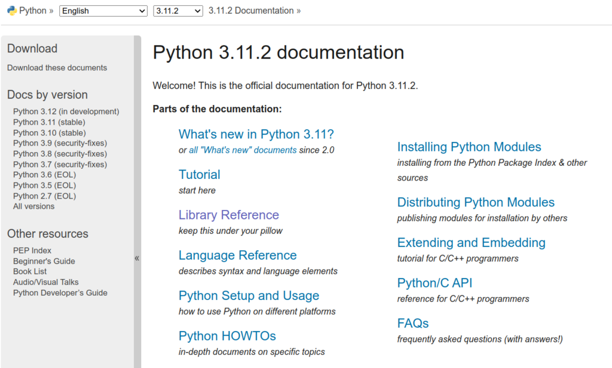
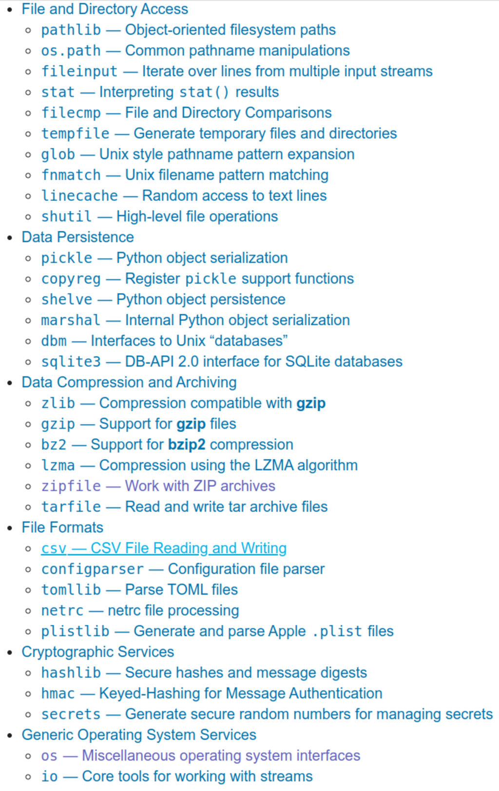

# Лекція 3. Python: стандартна бібліотека. Приклади застосування

---

## Python 3+

### Звідки починати

#### [Python 3+ documentation](https://docs.python.org/3/)
<details><summary>типи версий дистрибутивів Python</summary>

- Python 3.12 (in development)
- Python 3.11 (stable)
- Python 3.10 (stable)
- Python 3.9 (security-fixes)
- Python 3.8 (security-fixes)
- Python 3.7 (security-fixes)
- Python 3.6 (EOL)
- Python 3.5 (EOL)
- Python 2.7 (EOL)

</details>



#### Бібліотеки

<details><summary>Стандартна бібліотека Python</summary>

[Python 3+ Standard Library](https://docs.python.org/3/library/index.html)
 
- стандартна бібліотека, поширюється разом із Python, а також це деякі додаткові компоненти, які зазвичай входять до дистрибутивів Python.

- стандартна бібліотека Python дуже обширна, пропонує широкий спектр можливостей, про що свідчить довгий зміст, наведений нижче. 

- бібліотека містить вбудовані модулі (написані мовою C), які надають доступ до системних функцій, таких як файловий ввід/вивід, які інакше були б недоступні для програмістів на Python, а також модулі, написані на Python, які надають стандартизовані рішення для багатьох проблем, які виникають у щоденне програмування. 

- інсталятори Python для платформи Windows зазвичай містять усю стандартну бібліотеку, а також багато додаткових компонентів. Для Unix-подібних операційних систем Python зазвичай надається як набір пакетів, тому може знадобитися використовувати інструменти пакування, що надаються разом з операційною системою, щоб отримати деякі або всі додаткові компоненти.

- окрім стандартної бібліотеки, існує активна колекція із сотень тисяч компонентів (від окремих програм і модулів до пакетів і цілих фреймворків розробки додатків), доступна в індексі пакетів Python.

</details>


   
#### [Python Package Index](https://pypi.org/)

- jupiter
- pandas
- xlrd

### Пошук інших бібліотек

1. [Stack Overflow](https://stackoverflow.com/)


   - https://stackoverflow.com/questions/18885175/read-a-zipped-file-as-a-pandas-dataframe


2. Github, Gist, Bitbucket, GitLab ...


 
3. ChatGPT :)


### Короткий огляд Python і бібліотек

#### Всі на данний час стандартні бібліотеки
<details><summary>Built-in Types</summary>

* Truth Value Testing
* Boolean Operations — and, or, not
* Comparisons
* Numeric Types — int, float, complex
* Iterator Types
* Sequence Types — list, tuple, range
* Text Sequence Type — str
* Binary Sequence Types — bytes, bytearray, memoryview
* Set Types — set, frozenset
* Mapping Types — dict
* Context Manager Types
* Type Annotation Types — Generic Alias, Union
* Other Built-in Types
* Special Attributes
* Integer string conversion length limitation

</details>

<details><summary>Built-in Exceptions</summary>

* Exception context
* Inheriting from built-in exceptions
* Base classes
* Concrete exceptions
* Warnings
* Exception groups
* Exception hierarchy*

</details>

<details><summary>Text Processing Services</summary>

* string — Common string operations
* re — Regular expression operations
* difflib — Helpers for computing deltas
* textwrap — Text wrapping and filling
* unicodedata — Unicode Database
* stringprep — Internet String Preparation
* readline — GNU readline interface
* rlcompleter — Completion function for GNU readline

</details>

<details><summary>Binary Data Services</summary>

* struct — Interpret bytes as packed binary data
* codecs — Codec registry and base classes

</details>

<details><summary>Data Types</summary>

* datetime — Basic date and time types
* zoneinfo — IANA time zone support
* calendar — General calendar-related functions
* collections — Container datatypes
* collections.abc — Abstract Base Classes for Containers
* heapq — Heap queue algorithm
* bisect — Array bisection algorithm
* array — Efficient arrays of numeric values
* weakref — Weak references
* types — Dynamic type creation and names for built-in types
* copy — Shallow and deep copy operations
* pprint — Data pretty printer
* reprlib — Alternate repr() implementation
* enum — Support for enumerations
* graphlib — Functionality to operate with graph-like structures

</details>

<details><summary>Numeric and Mathematical Modules</summary>

* numbers — Numeric abstract base classes
* math — Mathematical functions
* cmath — Mathematical functions for complex numbers
* decimal — Decimal fixed point and floating point arithmetic
* fractions — Rational numbers
* random — Generate pseudo-random numbers
* statistics — Mathematical statistics functions

</details>

<details><summary>Functional Programming Modules</summary>

* itertools — Functions creating iterators for efficient looping
* functools — Higher-order functions and operations on callable objects
* operator — Standard operators as functions

</details>

<details><summary>File and Directory Access</summary>

* pathlib — Object-oriented filesystem paths
* os.path — Common pathname manipulations
* fileinput — Iterate over lines from multiple input streams
* stat — Interpreting stat() results
* filecmp — File and Directory Comparisons
* tempfile — Generate temporary files and directories
* glob — Unix style pathname pattern expansion
* fnmatch — Unix filename pattern matching
* linecache — Random access to text lines
* shutil — High-level file operations

</details>

<details><summary>Data Persistence</summary>

* pickle — Python object serialization
* copyreg — Register pickle support functions
* shelve — Python object persistence
* marshal — Internal Python object serialization
* dbm — Interfaces to Unix “databases”
* sqlite3 — DB-API 2.0 interface for SQLite databases

</details>

<details><summary>Data Compression and Archiving</summary>

* zlib — Compression compatible with gzip
* gzip — Support for gzip files
* bz2 — Support for bzip2 compression
* lzma — Compression using the LZMA algorithm
* zipfile — Work with ZIP archives
* tarfile — Read and write tar archive files

</details>

<details><summary>File Formats</summary>

* csv — CSV File Reading and Writing
* configparser — Configuration file parser
* tomllib — Parse TOML files
* netrc — netrc file processing
* plistlib — Generate and parse Apple .plist files

</details>

<details><summary>Cryptographic Services</summary>

* hashlib — Secure hashes and message digests
* hmac — Keyed-Hashing for Message Authentication
* secrets — Generate secure random numbers for managing secrets

</details>

<details><summary>Generic Operating System Services</summary>

* os — Miscellaneous operating system interfaces
* io — Core tools for working with streams
* time — Time access and conversions
* argparse — Parser for command-line options, arguments and sub-commands
* getopt — C-style parser for command line options
* logging — Logging facility for Python
* logging.config — Logging configuration
* logging.handlers — Logging handlers
* getpass — Portable password input
* curses — Terminal handling for character-cell displays
* curses.textpad — Text input widget for curses programs
* curses.ascii — Utilities for ASCII characters
* curses.panel — A panel stack extension for curses
* platform — Access to underlying platform’s identifying data
* errno — Standard errno system symbols
* ctypes — A foreign function library for Python

</details>

<details><summary>Concurrent Execution</summary>

* threading — Thread-based parallelism
* multiprocessing — Process-based parallelism
* multiprocessing.shared_memory — Shared memory for direct access across processes

</details>

<details><summary>The concurrent package</summary>

* concurrent.futures — Launching parallel tasks
* subprocess — Subprocess management
* sched — Event scheduler
* queue — A synchronized queue class
* contextvars — Context Variables
* _thread — Low-level threading API

</details>

<details><summary>Networking and Interprocess Communication</summary>

* asyncio — Asynchronous I/O
* socket — Low-level networking interface
* ssl — TLS/SSL wrapper for socket objects
* select — Waiting for I/O completion
* selectors — High-level I/O multiplexing
* signal — Set handlers for asynchronous events
* mmap — Memory-mapped file support

</details>

<details><summary>Internet Data Handling</summary>

* email — An email and MIME handling package
* json — JSON encoder and decoder
* mailbox — Manipulate mailboxes in various formats
* mimetypes — Map filenames to MIME types
* base64 — Base16, Base32, Base64, Base85 Data Encodings
* binascii — Convert between binary and ASCII
* quopri — Encode and decode MIME quoted-printable data

</details>

<details><summary>Structured Markup Processing Tools</summary>

* html — HyperText Markup Language support
* html.parser — Simple HTML and XHTML parser
* html.entities — Definitions of HTML general entities

</details>

<details><summary>XML Processing Modules</summary>

* xml.etree.ElementTree — The ElementTree XML API
* xml.dom — The Document Object Model API
* xml.dom.minidom — Minimal DOM implementation
* xml.dom.pulldom — Support for building partial DOM trees
* xml.sax — Support for SAX2 parsers
* xml.sax.handler — Base classes for SAX handlers
* xml.sax.saxutils — SAX Utilities
* xml.sax.xmlreader — Interface for XML parsers
* xml.parsers.expat — Fast XML parsing using Expat

</details>

<details><summary>Internet Protocols and Support</summary>

* webbrowser — Convenient web-browser controller
* wsgiref — WSGI Utilities and Reference Implementation
* urllib — URL handling modules
* urllib.request — Extensible library for opening URLs
* urllib.response — Response classes used by urllib
* urllib.parse — Parse URLs into components
* urllib.error — Exception classes raised by urllib.request
* urllib.robotparser — Parser for robots.txt
* http — HTTP modules
* http.client — HTTP protocol client
* ftplib — FTP protocol client
* poplib — POP3 protocol client
* imaplib — IMAP4 protocol client
* smtplib — SMTP protocol client
* uuid — UUID objects according to RFC 4122
* socketserver — A framework for network servers
* http.server — HTTP servers
* http.cookies — HTTP state management
* http.cookiejar — Cookie handling for HTTP clients
* xmlrpc — XMLRPC server and client modules
* xmlrpc.client — XML-RPC client access
* xmlrpc.server — Basic XML-RPC servers
* ipaddress — IPv4/IPv6 manipulation library

</details>

<details><summary>Multimedia Services</summary>

* wave — Read and write WAV files
* colorsys — Conversions between color systems

</details>

<details><summary>Internationalization</summary>

* gettext — Multilingual internationalization services
* locale — Internationalization services

</details>

<details><summary>Program Frameworks</summary>

* turtle — Turtle graphics
* cmd — Support for line-oriented command interpreters
* shlex — Simple lexical analysis

</details>

<details><summary>Graphical User Interfaces with Tk</summary>

* tkinter — Python interface to Tcl/Tk
* tkinter.colorchooser — Color choosing dialog
* tkinter.font — Tkinter font wrapper

</details>

<details><summary>Tkinter Dialogs</summary>

* tkinter.messagebox — Tkinter message prompts
* tkinter.scrolledtext — Scrolled Text Widget
* tkinter.dnd — Drag and drop support
* tkinter.ttk — Tk themed widgets
* tkinter.tix — Extension widgets for Tk

</details>

<details><summary>IDLE</summary>


</details>

<details><summary>Development Tools</summary>

* typing — Support for type hints
* pydoc — Documentation generator and online help system

</details>

<details><summary>Python Development Mode</summary>

</details>

<details><summary>Effects of the Python Development Mode</summary>

* ResourceWarning Example
* Bad file descriptor error example
* doctest — Test interactive Python examples
* unittest — Unit testing framework
* unittest.mock — mock object library
* unittest.mock — getting started
* 2to3 — Automated Python 2 to 3 code translation
* test — Regression tests package for Python
* test.support — Utilities for the Python test suite
* test.support.socket_helper — Utilities for socket tests
* test.support.script_helper — Utilities for the Python execution tests
* test.support.bytecode_helper — Support tools for testing correct bytecode generation
* test.support.threading_helper — Utilities for threading tests
* test.support.os_helper — Utilities for os tests
* test.support.import_helper — Utilities for import tests
* test.support.warnings_helper — Utilities for warnings tests

</details>

<details><summary>Debugging and Profiling</summary>


</details>

<details><summary>Audit events table</summary>

* bdb — Debugger framework
* faulthandler — Dump the Python traceback
* pdb — The Python Debugger

</details>

<details><summary>The Python Profilers</summary>

* timeit — Measure execution time of small code snippets
* trace — Trace or track Python statement execution
* tracemalloc — Trace memory allocations

</details>

<details><summary>Software Packaging and Distribution</summary>

* distutils — Building and installing Python modules
* ensurepip — Bootstrapping the pip installer
* venv — Creation of virtual environments
* zipapp — Manage executable Python zip archives

</details>

<details><summary>Python Runtime Services</summary>

* sys — System-specific parameters and functions
* sysconfig — Provide access to Python’s configuration information
* builtins — Built-in objects
* __main__ — Top-level code environment
* warnings — Warning control
* dataclasses — Data Classes
* contextlib — Utilities for with-statement contexts
* abc — Abstract Base Classes
* atexit — Exit handlers
* traceback — Print or retrieve a stack traceback
* __future__ — Future statement definitions
* gc — Garbage Collector interface
* inspect — Inspect live objects
* site — Site-specific configuration hook

</details>

<details><summary>Custom Python Interpreters</summary>

* code — Interpreter base classes
* codeop — Compile Python code

</details>

<details><summary>Importing Modules</summary>

* zipimport — Import modules from Zip archives
* pkgutil — Package extension utility
* modulefinder — Find modules used by a script
* runpy — Locating and executing Python modules
* importlib — The implementation of import

</details>

<details><summary>importlib.resources – Resources</summary>


</details>

<details><summary>Deprecated functions</summary>

* importlib.resources.abc – Abstract base classes for resources
* Using importlib.metadata
* The initialization of the sys.path module search path

</details>

<details><summary>Python Language Services</summary>

* ast — Abstract Syntax Trees
* symtable — Access to the compiler’s symbol tables
* token — Constants used with Python parse trees
* keyword — Testing for Python keywords
* tokenize — Tokenizer for Python source
* tabnanny — Detection of ambiguous indentation
* pyclbr — Python module browser support
* py_compile — Compile Python source files
* compileall — Byte-compile Python libraries
* dis — Disassembler for Python bytecode
* pickletools — Tools for pickle developers

</details>

<details><summary>MS Windows Specific Services</summary>

* msvcrt — Useful routines from the MS VC++ runtime
* winreg — Windows registry access
* winsound — Sound-playing interface for Windows

</details>

<details><summary>Unix Specific Services</summary>

* posix — The most common POSIX system calls
* pwd — The password database
* grp — The group database
* termios — POSIX style tty control
* tty — Terminal control functions
* pty — Pseudo-terminal utilities
* fcntl — The fcntl and ioctl system calls
* resource — Resource usage information
* syslog — Unix syslog library routines

</details>

<details><summary>Superseded Modules</summary>

* aifc — Read and write AIFF and AIFC files
* asynchat — Asynchronous socket command/response handler
* asyncore — Asynchronous socket handler
* audioop — Manipulate raw audio data
* cgi — Common Gateway Interface support
* cgitb — Traceback manager for CGI scripts
* chunk — Read IFF chunked data
* crypt — Function to check Unix passwords
* imghdr — Determine the type of an image
* imp — Access the import internals
* mailcap — Mailcap file handling
* msilib — Read and write Microsoft Installer files
* nis — Interface to Sun’s NIS (Yellow Pages)
* nntplib — NNTP protocol client
* optparse — Parser for command line options
* ossaudiodev — Access to OSS-compatible audio devices
* pipes — Interface to shell pipelines
* smtpd — SMTP Server
* sndhdr — Determine type of sound file
* spwd — The shadow password database
* sunau — Read and write Sun AU files
* telnetlib — Telnet client
* uu — Encode and decode uuencode files
* xdrlib — Encode and decode XDR data

</details>

<details><summary>Security Considerations</summary>
</details>


--- 

### Те ще може знадобитись нам

- рекомендую
  - [collections — Container datatypes](https://docs.python.org/3/library/collections.html)
  - [itertools — Functions creating iterators for efficient looping](https://docs.python.org/3/library/itertools.html)
  - [datetime — Basic date and time types](https://docs.python.org/3/library/datetime.html)
  - [re — Regular expression operations](https://docs.python.org/3/library/re.html)
  - [functools — Higher-order functions and operations on callable objects](https://docs.python.org/3/library/functools.html)

- [request](https://docs.python.org/3/library/urllib.request.html#module-urllib.request)

```python
import urllib.request

local_filename, headers = urllib.request.urlretrieve('http://python.org/')
html = open(local_filename)
html.close()
```

- [os](https://docs.python.org/3/library/os.html): [os.path.join](https://docs.python.org/3/library/os.path.html#module-os.path):
```python
import os

working_dir = "~/data"
zipfile_name = "f.zip"
fn_arc_zip = os.path.join(working_dir, zipfile_name)
```

- [zipfile](https://docs.python.org/3/library/zipfile.html)

```python
from zipfile import ZipFile

with ZipFile('file.zip', 'w') as myzip:
    myzip.write('file.txt')
```

- [csv](https://docs.python.org/3/library/csv.html)

```python
import csv

with open('file.csv', newline='') as csvfile:
    reader = csv.reader(csvfile, delimiter=' ', quotechar='|')
    for row in reader:
        print(', '.join(row))

...

with open('file.csv', 'w', newline='') as csvfile:
    writer = csv.writer(csvfile, delimiter=' ', quotechar='|', quoting=csv.QUOTE_MINIMAL)
    writer.writerow(['test_test'] * 5 + ['Test 2'])
    writer.writerow(['test 1', 'test 2', 'test 3'])
```

- [json](https://docs.python.org/3/library/json.html)

```python
import json

json.dumps(['foo', {'bar': ('baz', None, 1.0, 2)}])
json.dumps([1, 2, 3, {'4': 5, '6': 7}], separators=(',', ':'))
json.dumps({'4': 5, '6': 7}, sort_keys=True, indent=4)
json.loads('["foo", {"bar":["baz", null, 1.0, 2]}]')

```

### Висновки до лекції

- Стандартна бібліотека має майже всі необхідні бібліотеки
- універсальня для застосування 
- але ... 

- існуюсть інші бібліотеки: 
  - більш зручні
  - швидші 
  - спеціалізовані
  - зазвичай менш універсальні

---

# [Література та посилання](links.md)

---

# [На головну сторінку ...](../README.md)
