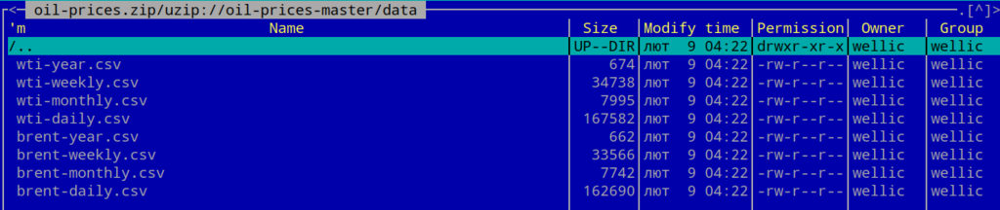

# Лекція 4. Системи збереження та сховища даних. Формати даних

---

## Системи збереження та сховище даних.

### Термінологія

#### Transaction

> Транза́кція це здійснення закінчених дій стосовно визначеного об'єкта, що переводить цей об'єкт з одного постійного стану в інший. В різних областях використання цього поняття існують певні відмінності у тлумаченні слова. Так наприклад:

- в інформатиці, транзакція відіграє важливу роль в базах даних, є логічною одиницею і зобов'язана відповідати принципам ACID (від англ. Atomicity, Consistency, Isolation, та Durability). Гарантує збереження цілісності бази даних.
- в економіці, транзакція означає зміну права розпорядження матеріальними благами або послугами, в якій бере участь більш ніж один суб'єкт
- в методі транзакційного аналізу, транзакція є одиницею спілкування двох персон
- як банківська операція, що полягає в переведенні коштів з одного рахунку на інший

#### ACID

Коли йдеться про бази даних, можуть з'явитися слова «Вимоги ACID».

> ACID: це набір вимог, які забезпечують збереження даних. Це особливо важливо для фінансових операцій. 
 
Ми ж не хочемо залишитися без грошей через розрив з'єднання чи помилки в ПЗ :smile:

1. **Atomicity** - Атомарність
    - rтомарність гарантує, що кожну транзакцію буде виконано повністю або не буде виконано зовсім. Не допускаються проміжні стани.
2. **Consistency** - Узгодженість
    - Узгодженість грантаує, що кожна успішна транзакція фіксує лише допустимі результати. Завдяки тому, що транзакція не допускає проміжних результатів, база залишається консистентною. Успішна транзакція фіксує свої результати та зберігає узгодженість бази даних. Тобто до виконання операції і після цього база залишається консистентною або узгодженою
3. **Isolation** - Ізольованість
    - під час виконання транзакції паралельні транзакції не повинні впливати на результат.
4. **Durability** - Надійність
    - Якщо користувач отримав підтвердження від системи, що транзакція виконана, він може бути впевнений, що зроблені ним зміни не будуть скасовані через будь-який збій. Знеструмилася система, стався збій в обладнанні? На виконану транзакцію це не вплине.

### Cистеми збереження

#### Реляційні бази даних

##### Опис

> Реляційна база даних — база даних, заснована на реляційній моделі даних. Слово «реляційний» походить від англ. relation (відношення). Для роботи з реляційними БД застосовують реляційні СКБД. Реляційна база даних є сукупністю елементів даних, організованих у вигляді набору формально описаних таблиць, з яких дані можуть бути доступними або повторно зібрані багатьма різними способами без необхідності реорганізації таблиць бази даних.

##### Реалізіції

- Mysql
- Postgres
- MSSQL
- TrasactSQL
- ...

#### NOSQL

##### Опис

> NoSQL (non SQL або non Relational) — база даних, яка забезпечує механізм зберігання та видобування даних відмінний від підходу таблиць-відношень в реляційних базах даних

- існують давно з 1960-х років, але тоді вони ще не здобули гучне ім'я «NoSQL»
- одержали сплеск популярності на початку 21-ого століття, що був спричинений потребами компаній, такими як Facebook, Google, та Amazon.com
- NoSQL бази даних все більше і більше використовуються в задачах із застосуванням великих даних та real-time web-застосунках
- NoSQL системи також називають «Not only SQL» для підкреслення того, що вони все-таки можуть підтримувати SQL-подібну структуру та мову запитів

:heavy_plus_sign:

- простоту дизайну схеми БД,
- значно спрощене горизонтальне масштабування на кластери машин (що є проблемою для реляційних баз даних)
- тонкий контроль над доступністю
- Структури даних, що використовуються в NoSQL (такі як ключ-значення, сховище з широким стовпчиком, граф, документ) є відмінними від тих, що використовуються за замовчуванням в реляційних базах, що робить тим самим деякі операції над даними значно швидшими на NoSQL.

:heavy_minus_sign:

- точна відповідність та доречність використання баз даних NoSQL залежить від задач, котрі вирішуються
- шноді структури даних, які використовуються в NoSQL базах можуть розглядатись як більш гнучкі, ніж таблиці реляційних моделей, але дуже "художні"

##### Реалізації

- Mongo DB
- Redis
- Memcached
- Casandra
- ...

#### Хмарні, розподілені, стрімінгові

Сучасні системи - це системи з обмін повідомленнями. Це значить, повинні існувати системи з способом координації в конкурентних, паралельних, та об'єктно-орієнтованих системах, та організації взаємодії між процесами. Координація робиться шляхом відсилання повідомлень отримувачу. Повідомлення можуть мати форму викликів функцій, сигналів, та пакетів даних. До найвідоміших моделей обчислень, основаних на обміні повідомленнями належать модель Актора та числення процесів.

Тобто ми кажемо про програми та системм миттєвого обміну повідомленнями. Мікроядерні операційні системи координують роботу ядра та програм обміном повідомлень. Розподілені системи доступу до об'єктів та віддаленого виклику методів, такі як ONC RPC, CORBA, Java RMI, DCOM, SOAP, .NET Remoting та їм подібні є системами з обміном повідомленнями. Цей термін також використовується в галузі надпотужних обчислювальних систем.

Або ці платформи, можуть реалізовувати системи обміну повідомленнями між компонентами програмної системи на основі стандарту AMQP (Advanced Message Queuing Protocol).

- RabitMQ
- Amazon SQS
- OpenAMQ
- MemcacheDB
- Kafka
- GCP BigQuery

### Локальні та файлові системи

#### Berkeley DB (BDB)

##### Опис


- високопродуктивна вбудовувана система керування базами даних, реалізована у вигляді бібліотеки
- використовується як засіб для побудови індексів в системі, що зберігаються, або як сховище даних
- нереляційна система - зберігає пари «ключ - значення» як масиви байтів, підтримує багато значень для одного ключа

##### Загальні технічні характеристики

- owners: Sleepycat Softwared, Oracle Corporation, Margo Seltzerd і Keith Bosticd
- OS: Windows, Linux, IBM AIX, Solaris, SCO Linux, Mac OS ...
- Мова програмування: C/C++

##### Використовують

- Bogofilter – A free/open source spam filter that saves its wordlists using BDB by default
- Citadel – A free/open source groupware platform that keeps all of its data stores, including the message base, in BDB
- Sendmail – A free/open source mail application for Linux/Unix systems
- Spamassassin – A free/open source anti-spam application

:heavy_plus_sign:

- підтримуються
    - ACID-транзакції
    - детальні блокування
    - інтерфейс розподілених транзакцій
    - гаряче резервне копіювання
    - реплікації
    - SQL підтримується як один з інтерфейсів
    - існують засоби для роботи з Berkeley DB на більшості популярних мов програмування: Perl, Python, PHP, ...

:heavy_minus_sign:

- BDB відсутній мережевий доступ — програми використовують базу даних через виклики внутрішнього API

#### SQLite


##### Опис

> SQLite — полегшена реляційна система керування базами даних

- втілена у вигляді бібліотеки, в яких реалізовано частина стандарту SQL-92.
- початковий код SQLite поширюється як суспільне надбання (англ. public domain), тобто може використовуватися без обмежень та безоплатно з будь-якою метою. Фінансову підтримку розробників SQLite здійснює спеціально створений консорціум, до якого входять такі компанії, як Adobe, Oracle, Mozilla, Nokia, Bentley[en] і Bloomberg.

##### Загальні технічні характеристики

- Тип: реляційна система управління базами даних
- Розробник Річард Гіп
- OS: багатоплатформовість
- Мова програмування: C
- З 2018 року SQLite, як й JSON та CSV, рекомендований Бібліотекою Конгресу США формат зберігання структурованого набору даних

##### Використання

:heavy_plus_sign:

- особливістю SQLite є те, що вона не використовує парадигму клієнт-сервер, тобто SQLite не є окремим процесом, з яким взаємодіє застосунок, а надає бібліотеку, з якою програма компілюється і стає складовою частиною програми
- це зменшує накладні витрати, час відгуку і спрощує програму
- SQLite зберігає всю базу даних (включаючи визначення, таблиці, індекси і дані) в єдиному стандартному файлі на тому комп'ютері, на якому виконується застосунок
- ACID-функції досягаються шляхом створення файлу-журналу
- кілька процесів або потоків можуть одночасно без жодних проблем читати дані з однієї бази. Запис в базу можна здійснити тільки в тому випадку, коли жодних інших запитів у цей час не обслуговується; інакше спроба запису закінчується невдачею, і в програму повертається код помилки. Іншим варіантом розвитку подій є автоматичне повторення спроб запису протягом заданого інтервалу часу.
- завдяки архітектурі можливо використовувати SQlite як на вбудовуваних (embedded) системах, так і на виділених машинах з гігабайтними масивами даних
- реалізує значну частину стандарту SQL92
- простий, легкий у використанні API
- транзакції атомарні, послідовні, ізольовані, і міцні (ACID) навіть після збоїв системи і збоїв живлення
- немає зовнішніх залежностей
- підтримка терабайтних розмірів баз даних і гігабайтного розміру рядків і BLOBів

:heavy_minus_sign:

- відсутність системи користувачів - більші СУБД включають до складу системи управління правами доступу користувачів.
- зазвичай використовується у невеликих додатках
- відсутність можливості збільшення продуктивності
- досить складно збільшити пробуктивніть цієї СУБД
- залежить від проекту, важко модифікувати

### Applications for RDMS, NoSQL, Graph, etc

#### [DataGrip](https://www.jetbrains.com/datagrip/)


#### [DBeaver](https://dbeaver.io/)


##### SQL


##### Analytical


##### Timeseries


##### Embedded


##### BigData


##### Fulltext Search


##### Graph


## Формати даних та файлів

### Формат файлів

> Файл - це структурована або неструктурована послідовність байтів (bytes)

> Формат файлу - це формалізована структура будови файлу

Програми, зберігають у файлах структуровані дані, повинні якось перетворювати їх в послідовність байтів і навпаки:

- в ООП ці операції називаються, відповідно, «серіалізацією» і «десеріалізацією»
- для текстової інформації останнє також називається «розбір» або «парсинг»
- алгоритм цих перетвореннь, а також угоди (контракти) про те, як різні фрагменти інформації розташовуються усередині файлу, і складають його «формат»
- різні формати файлів можуть різнитися ступенем деталізації, один формат може бути «надбудовою» над іншим або використовувати елементи інших форматів. Наприклад, текстовий формат накладає лише загальні обмеження на структуру даних. Формат HTML встановлює додаткові правила на внутрішній сруктуру файлу, але при цьому будь-який HTML-файл є водночас текстовим файлом

### Специфікації

- для багатьох форматів файлів існують опубліковані специфікації (RFC), в яких детально описано структуру файлів даного формату, те, як програми повинні кодувати дані для запису в цей формат і як декодувати їх при зчитуванні
- більшість таких специфікацій вільнодоступні, але деякі поширюються за плату
- компанії можуть вважати певні формати файлів своєю комерційною таємницею і не публікувати їх. Наприклад — формати файлів пакету Microsoft Office.
- у деяких випадках компанія, що випустила якийсь додаток, просто не вважає за потрібне витрачати час на написання докладної специфікації
- якщо специфікація формату недоступна, то для забезпечення сумісності програми з даним форматом доводиться займатися reverse-engeniering
- Але ... у широко-поширеному форматі GIF використовувався патентований алгоритм, що призвело до розробки альтернативного формату PNG.

#### Визначення типу файлу

Тип файлу — це інформація для швидкої ідентифікації вмісту файлу операційною системою і користувачем без необхідності зчитування всього вмісту файлу. Завдяки цій інформації, користувач приблизно знає тип інформації у файлі, а в операційній системі може бути знайдена програма для обробки файлів даного типу. З історичних причин, в різних операційних системах використовуються різні підходи для вирішення цього завдання.

В Linux для визначення формату файлу використовується програма file, яка використовує бібліотеку libmagic для доступу до бази даних файлових сигнатур «magic

<details><summary>Перелік файлових форматів (за типом)</summary>

1. Архівування та стиснення
2. Рецепти глазурі, кераміка
3. Комп'ютерний дизайн
4. База даних
5. Настільне видавництво
6. Документ
7. Фінансові записи
8. Файл шрифту
9. Географічна інформаційна система
10. Графічна інформація організаторів
11. Графіка
12. Посилання та ярлики
13. Математичні
14. Код об'єкта, виконувані файли, спільні та динамічно пов'язані бібліотеки
15. Мова опису сторінки
16. Менеджер персональної інформації
17. Презентація
18. Програмне забезпечення для управління проектами
19. Довідкове програмне забезпечення для управління
20. Наукові дані (обмін даними)
21. Мови програмування та скрипти
22. Безпека
23. Дані сигналу (не аудіо)
24. Звук і музика
25. Формати списку відтворення
26. Редагування звуку та виробництво музики
27. Записані телевізійні формати
28. Вихідний код для комп'ютерних програм
29. Електронна таблиця
30. Табличні дані
31. Відео
32. Дані відеоігор
33. Носії для зберігання відеоігор
34. Віртуальні машини
35. Вебсторінка
36. Мови розмітки та інші формати на основі вебстандартів
37. Інші
38. Узагальнені файли

</details>

### Приклади

- PNG, PDF

```shell
$ file logo.png 

logo.png: PNG image data, 1024 x 121, 8-bit/color RGBA, non-interlaced
```

```shell
$ file "Bank Statemet.pdf" 

Bank Statemet.pdf: PDF document, version 1.7
```

- MD

```shell
$ file task.md

task.md: UTF-8 Unicode text
````


- ZIP

```shell
$ file oil-prices.zip 

oil-prices.zip: Zip archive data, at least v1.0 to extract
```




-

```shell
$ file wti-year.csv 

wti-year.csv: CSV text
```


-

```shell
$ file wti-year.json 

wti-year.json: JSON data
```


```shell
$ file wti-year.xlsx 

wti-year.xlsx: Microsoft Excel 2007+
```


### Висновки до теми

Розглянули такі питання:

- Системи збереження та сховище даних.
- Термінологію з цим пов'язану
- типи баз даних та реалізацій
- формати файлів їх приклади

---

# [Література та посилання](links.md)

---

# [На головну сторінку ...](../README.md)
