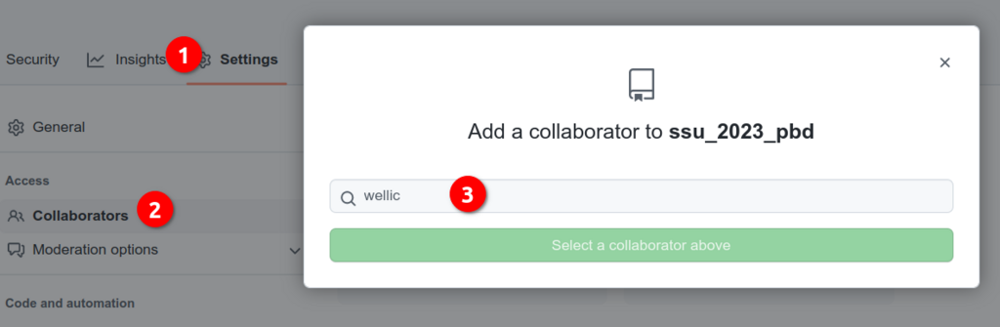
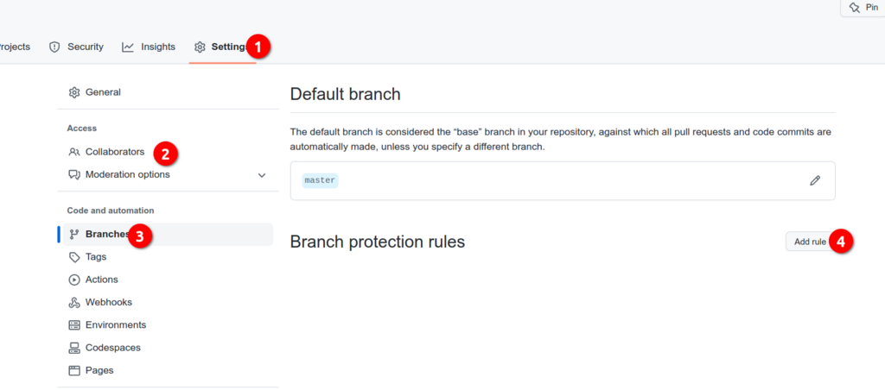
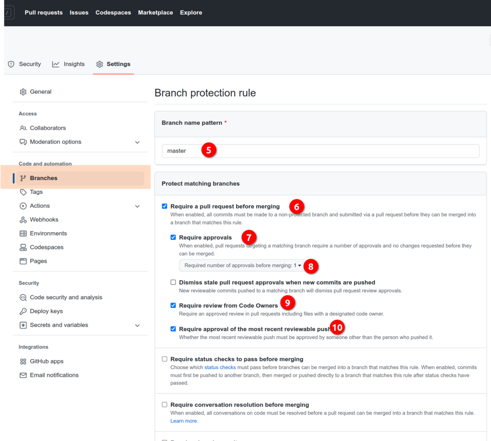
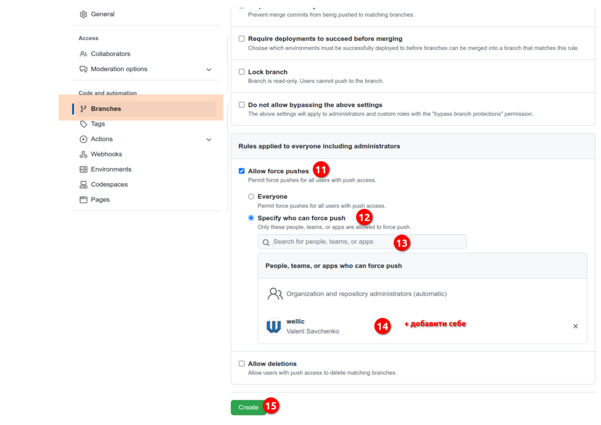

# Практикум 4. Робота з отриманими даними. Зчитування, конвертація, зберігання

---

## Підготовка даних для роботи

```shell
cd labs
mkdir lab4
```

Скопіювати скрипти з фолдера `utils/sh/lab4`

### :warning: Налаштування для PullRequests

:exclamation: 
Для належної роботи з PullRequest, будь ласка, перевірте, додайте або змініть наступні налаштування:

#### Settings/Collaborators: додати мене в Ваш репозиторій, як співавтора 



#### Settings/Branches: налаштувати дефолтну гілку master

1. добавити правило для гілки master

2. налаштувати правило для ревью

3. налаштувати правило для push-force


### Домашня робота

1. Підготовути ПР для lab4 
   1. повторити результати
   2. Назначити мене ревьювером
   3. Вислати лінк на ПР
2. Якщо ПР - OK, то я змержу його в Ваш мастер

---

# [Література та посилання](links.md)

---

# [На головну сторінку ...](../README.md)
