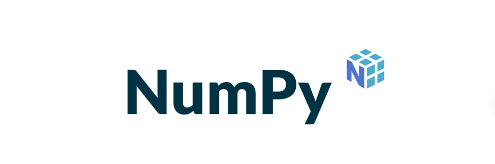
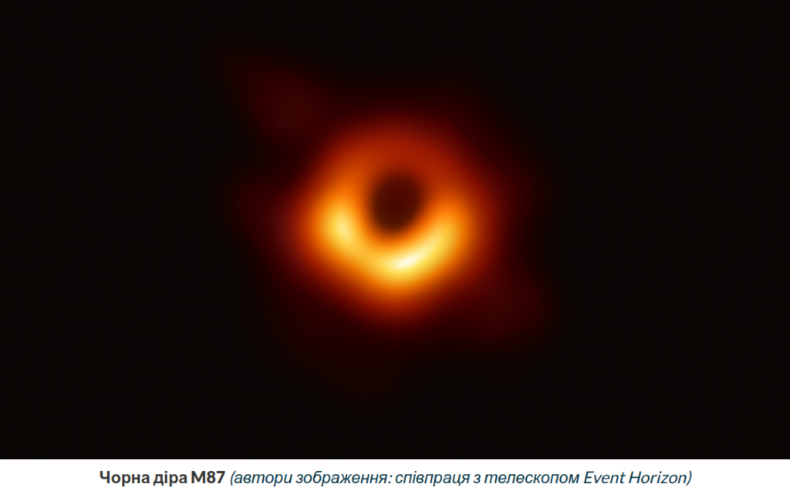
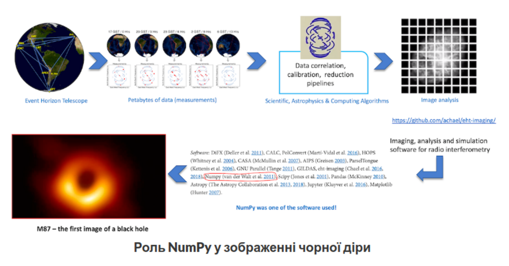
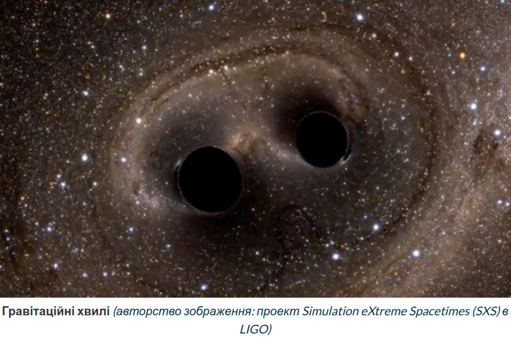
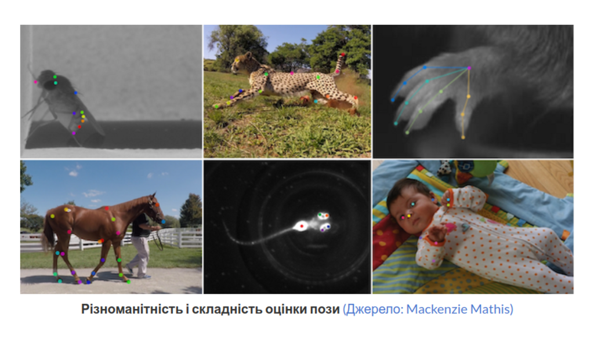
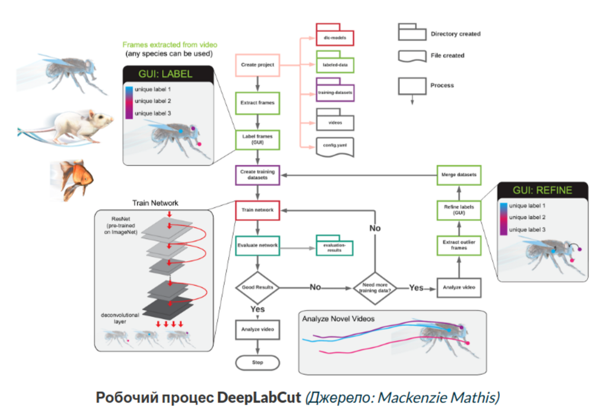
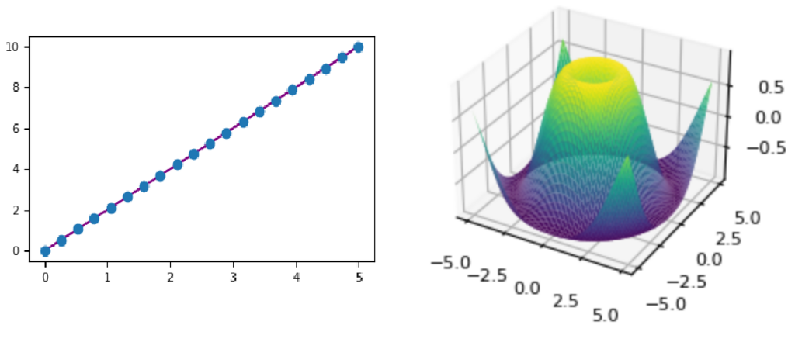

# Лекція 5. NumPy: Використання, застосування, приклади

---

## Що таке NumPy



- це основний пакет для наукових обчислень на Python
- це бібліотека Python, яка надає об’єкт багатовимірного масиву, різні похідні об’єкти (такі як замасковані масиви та матриці).масивних обчислень сьогодні
- це набір процедур для швидких операцій над масивами. Швидкі та універсальні концепції векторизації, індексації та трансляції NumPy є фактичними стандартами в сучастній комп'ютерній математиці:
    - математичні, логічні, маніпуляції формою масивів
    - сортування, вибір, введення/виведення
    - комплексні математичні функції
    - генератори випадкових чисел
    - процедури лінійної алгебри
    - перетворення Фур’є
    - основні статистичні операції
    - випадкове моделювання та багато іншого.
- ядром NumPy є добре оптимізований код C, тобто це гнучкість Python зі швидкістю скомпільованого коду
- високорівневий синтаксис NumPy робить його доступним і продуктивним для програмістів із будь-яким рівнем підготовки та досвіду
- NumPy підтримує широкий спектр апаратного забезпечення та обчислювальних платформ і добре працює з розподіленими бібліотеками, бібліотеками GPU та розрідженими масивами
- відкритий код на [github](https://github.com/numpy/numpy)

## Eкосистема


- наукова сфера
- бібліотеки масивів
- data science
- машинне навчання
- візуалізація
- квантові обчислення, обробка сигналів та обробка зображення
- астрономічні процеси
- біоінформатика
- статистика, математичний аналіз, хімія, геологія, географія, архітектура, інженерія
- графіки та мережі

### Приклади цікавих досліджень

#### [Перше зображення чорної діри](https://numpy.org/case-studies/blackhole-image/)



NumPy разом із такими бібліотеками, як SciPy і Matplotlib, які залежать від NumPy, дозволили телескопу Event Horizon створити перше в історії зображення чорної діри



#### [Виявлення гравітаційних хвиль](https://numpy.org/case-studies/gw-discov)




Гравітаційні хвилі, що випромінюються від злиття інших гравітаційних хвиль, не можуть бути обчислені за допомогою жодної техніки, окрім моделювання чисельної відносності за допомогою суперкомп’ютерів. Обсяг даних, які збирає LIGO, настільки ж незбагненно великий, наскільки малі сигнали гравітаційних хвиль.

NumPy, стандартний пакет числового аналізу для Python, використовувався програмним забезпеченням для виконання різноманітних завдань під час проекту виявлення гравітаціних хвиль в проекті LIGO.

Ефективний і адаптований n-вимірний масив, який є центральною функцією NumPy, дозволив дослідникам маніпулювати великими числовими наборами даних, забезпечивши основу для першого в історії зображення чорної діри. Знаковий момент у науці, він дає приголомшливі візуальні докази теорії Ейнштейна. Досягнення охоплює не лише технологічні прориви, але й міжнародну співпрацю між понад 200 вченими та одними з найкращих у світі радіообсерваторій. Інноваційні алгоритми та методи обробки даних, вдосконалені існуючі астрономічні моделі, допомогли розкрити таємницю Всесвіту.

#### [Спортивна аналітика](https://numpy.org/case-studies/cricket-analytics)


Спортивна аналітика – це сфера для аналізу, що процвітає.

Багато дослідників і компаній використовують NumPy та інші пакети PyData, такі як Scikit-learn, SciPy, Matplotlib і Jupyter, окрім використання новітніх методів машинного навчання та ШІ. NumPy використовувався для різних видів спортивної аналітики

- аналітика спортивних даних використовується у багатьох інших видах спорту для покращення загальної продуктивності команди та максимізації шансів на перемогу
- аналітика даних у режимі реального часу може допомогти в отриманні інформації навіть під час гри для зміни тактики команди та пов’язаних компаній для економічної вигоди та зростання
- окрім історичного аналізу, прогнозні моделі використовуються для визначення можливих результатів матчів, які вимагають значної обробки чисел і наукових ноу-хау даних, інструментів візуалізації та можливості включати в аналіз новіші спостереження

#### [Біоінформатика і моделювання](https://numpy.org/case-studies/deeplabcut-dnn/)



[DeepLabCut](http://www.mackenziemathislab.org/deeplabcut) — це набір інструментів з відкритим вихідним кодом, який дає змогу дослідникам у сотнях установ по всьому світу відстежувати поведінку лабораторних тварин, навіть людей, використовуючи дуже невеликі навчальні дані, з точністю на рівні людини. Завдяки технології DeepLabCut вчені можуть глибше заглибитися в наукове розуміння моторного контролю та поведінки різних видів тварин і часових масштабів.

Кілька галузей досліджень, зокрема нейронаука, медицина та біомеханіка, використовують дані відстеження руху тварин. DeepLabCut допомагає зрозуміти, що роблять люди та інші тварини, аналізуючи дії, записані на плівку. Використовуючи автоматизацію для трудомістких завдань позначення тегами та моніторингу, а також глибокий аналіз даних на основі нейронної мережі, DeepLabCut робить наукові дослідження за участю тварин, таких як примати, миші, риби, мухи тощо, набагато швидшими та точнішими.




NumPy задовольняє основну потребу технології DeepLabCut у високошвидкісних чисельних обчисленнях для поведінкової аналітики. Крім NumPy, DeepLabCut використовує різноманітне програмне забезпечення Python, яке використовує NumPy у своїй основі, наприклад SciPy , Pandas , matplotlib , Tensorpack , imgaug , scikit-learn , scikit-image і Tensorflow .

#### AI


## Як це працює

- в основі пакета NumPy лежить об’єкт `ndarray`
- `ndarray` інкапсулює `n-вимірні` масиви однорідних(!) типів даних, причому багато операцій виконуються в скомпільованому коді для забезпечення продуктивності
- важливі відмінності між масивами NumPy і стандартними послідовностями Python:
- масиви NumPy мають фіксований розмір під час створення, на відміну від списків Python (які можуть динамічно зростати). Зміна розміру масиву `ndarray` створить новий масив і видалить оригінальний
- усі елементи в масиві NumPy мають мати однаковий тип даних і, таким чином, матиме однаковий розмір у пам’яті. Виняток: можна мати масиви (Python, включаючи NumPy) об’єктів, що дозволяє створювати масиви елементів різного розміру
- масиви NumPy полегшують розширені математичні та інші види операцій над великою кількістю даних. Як правило, такі операції виконуються ефективніше та з меншою кількістю коду, ніж це можливо за допомогою вбудованих послідовностей Python
- більшість наукових і математичних пакетів на основі Python використовує масиви NumPy, хоча вони зазвичай підтримують введення послідовності Python, вони перетворюють такі введення в масиви NumPy перед обробкою, і вони часто виводять масиви NumPy. Іншими словами, щоб ефективно використовувати більшу частину (можливо, навіть більшість) сьогоднішнього наукового/математичного програмного забезпечення на основі Python, просто знати, як використовувати вбудовані типи послідовностей Python, недостатньо - потрібно також знати, як використовувати масиви NumPy.

### Приклад простої ітерації

Як простий приклад розглянемо випадок множення кожного елемента в одновимірній послідовності `a` з елементами посліовності `b`.

Це дає правильну відповідь, але якщо кожне aз bних містить мільйони чисел, ми заплатимо ціну за неефективність циклу в Python. Ми могли б виконати те саме завдання набагато швидше в C, написавши (для ясності ми нехтуємо оголошеннями змінних та ініціалізаціями, розподілом пам’яті тощо)

#### Python

```python
c = []
rows = len(a)
for i in rows:
  c.append(a[i] * b[i])
```

#### С

Код на `C/C++` економить усі накладні витрати, пов’язані з інтерпретацією коду Python і маніпулюванням об’єктами Python, але за рахунок переваг, отриманих від кодування на Python.

##### 1-D массив

```cpp
for (i = 0; i < rows; i++) {
  c[i] = a[i]*b[i];
}
```

##### 2-D массив

Крім того, необхідна додаткова робота з кодування збільшується разом із розмірністю наших даних.

```cpp
for (i = 0; i < rows; i++) {
  for (j = 0; j < columns; j++) {
    c[i][j] = a[i][j]*b[i][j];
  }
}
```

#### NumPy

NumPy дає нам найкраще з обох світів: поелементні операції є «режимом за замовчуванням», коли використовується ndarray, але поелементна операція швидко виконується попередньо скомпільованим кодом C. 

```python
c = a * b
```

##### Основні переваги 

- робить те ж саме, що й попередні приклади, зі швидкістю, близькою до C
- простота коду, яка зменшує кількість помилок
- векторизація та узагальнення

### Чому NumPy швидкий

- векторизація описує відсутність будь-яких явних циклів
- індексування тощо в коді, відбувається в оптимізованому, попередньо скомпільованому коді C.

Векторизований код має багато переваг, серед яких:

- векторизований код більш стислий і легший для читання
- менше рядків коду зазвичай означає менше помилок
- код більше нагадує стандартну математичну нотацію (що полегшує, як правило, правильне кодування математичних конструкцій)
- векторизація призводить до більш «Pythonic» коду. Без векторизації наш код був би усіяний неефективними та складними для читання for-циклами.
- NumPy повністю підтримує об’єктно-орієнтований підхід, знову починаючи з ndarray . Наприклад, ndarray — це клас, який має числові методи та атрибути. Багато з його методів віддзеркалюються функціями в самому зовнішньому просторі імен NumPy, що дозволяє програмісту кодувати в будь-якій парадигмі, яка йому подобається. Ця гнучкість дозволила діалекту масиву NumPy і класу NumPy ndarray стати де-факто мовою обміну багатовимірними даними, що використовується в Python.


### Приклад взаємодії з іншими бібліотеками 

```python
import numpy as np
import matplotlib.pyplot as plt

# %matplotlib inline

#2D
x = np.linspace(0, 5, 20)
y = np.linspace(0, 10, 20)
plt.plot(x, y, 'purple') # line
plt.plot(x, y, 'o')      # dots
fig = plt.figure()

#3D
ax = fig.add_subplot(projection='3d')
X = np.arange(-5, 5, 0.15)
Y = np.arange(-5, 5, 0.15)
X, Y = np.meshgrid(X, Y)
R = np.sqrt(X**2 + Y**2)
Z = np.sin(R)

ax.plot_surface(X, Y, Z, rstride=1, cstride=1, cmap='viridis')
```




## Висновки до теми

- Ознайомились з прикладами, де використовується пакет NumPy    
- Отримрали загальні відомості про NumPY
- На найближчій практиці ми зробимо більшість основних операцій, які є в NumPy


---

# [Література та посилання](links.md)

---

# [На головну сторінку ...](../README.md)
