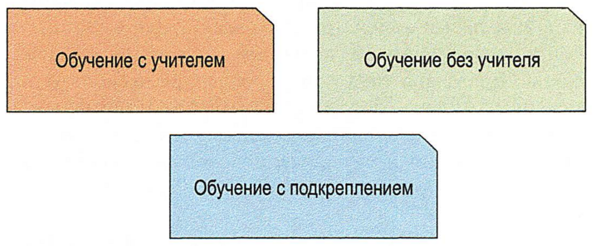
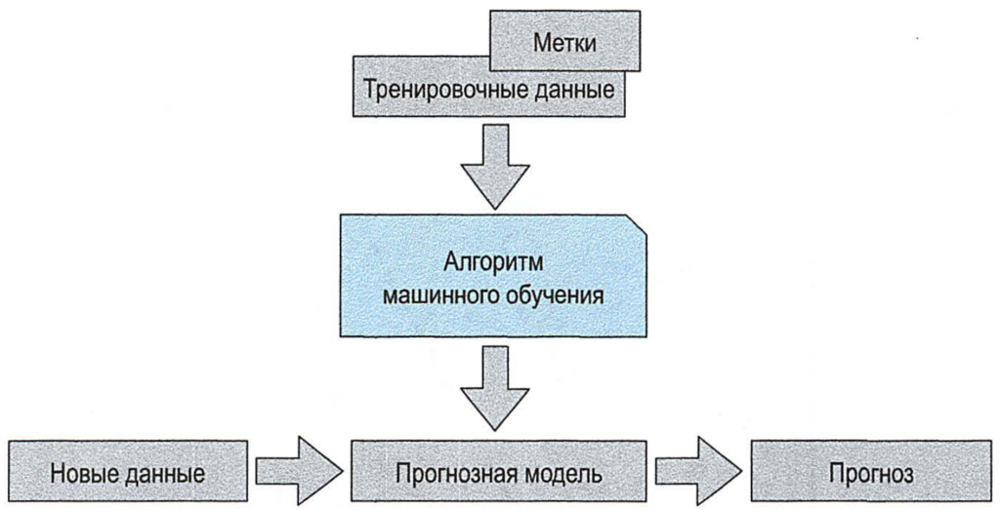
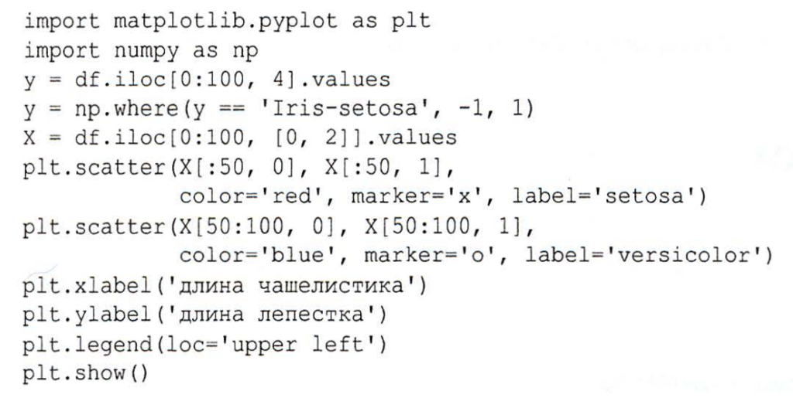
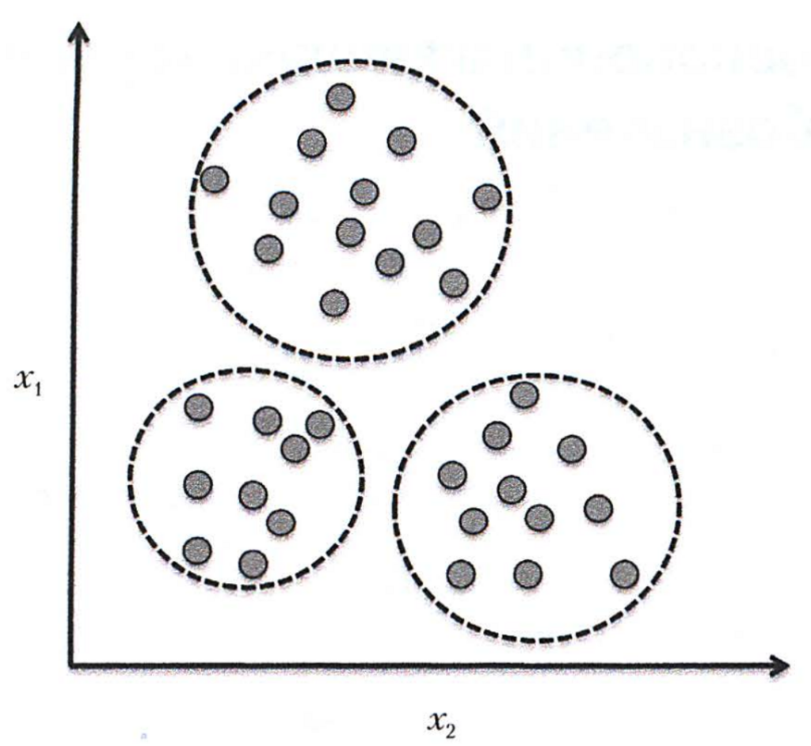
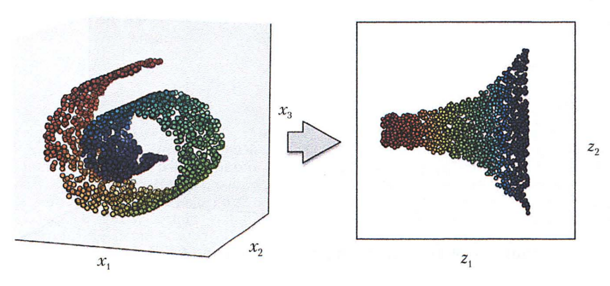
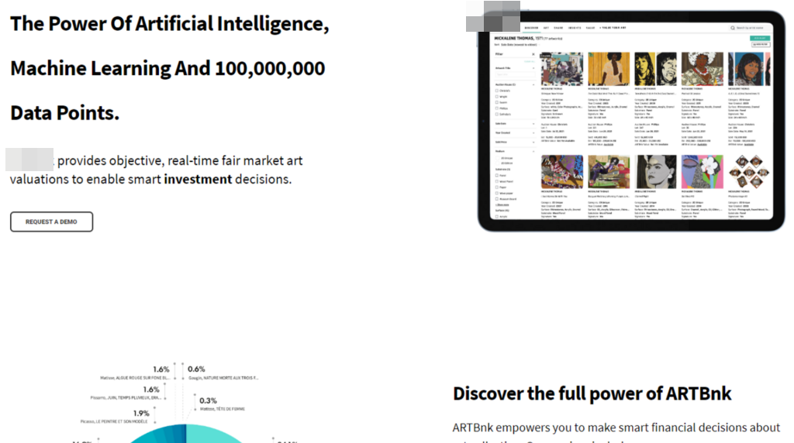
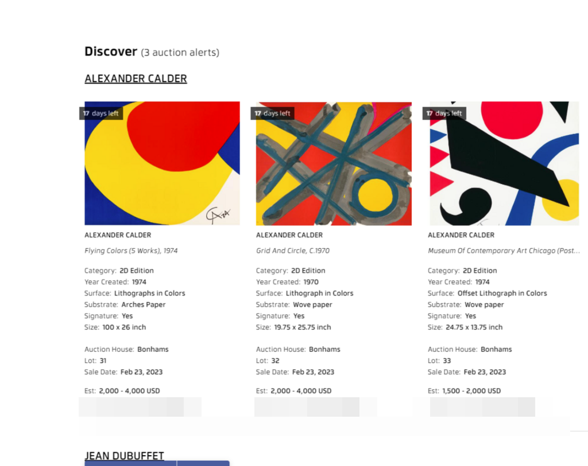
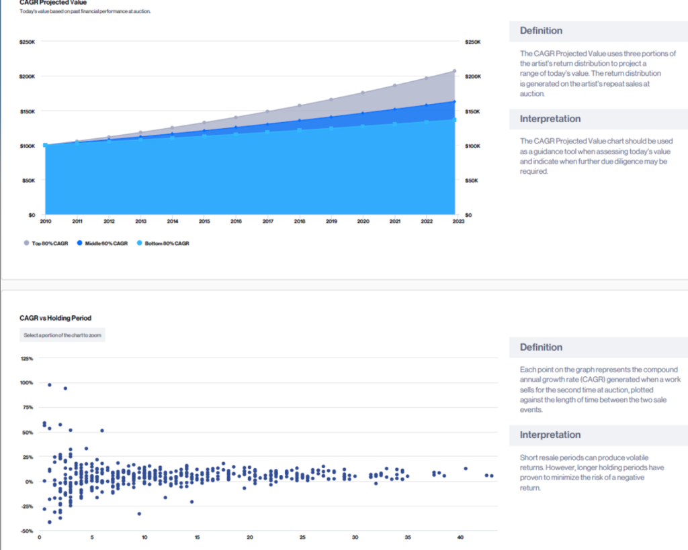
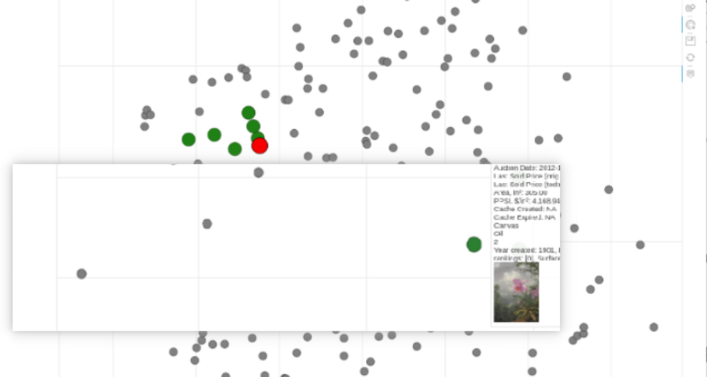

# Вступ

---

## Проблеми 

- генерується величезна кількість даних щодня, більше $10^{18}$ байт
- дані збираються різними системами
- дані мають високий ступінь дублювання
- складність аналізу великих даних та знаходження закономірностей
- данні "брудні" 
- ...

## Мета

- отримати практичні навички на невеликих порціях даних готовити прототип коду 
- будувати моделі, як для навчання, так і для різних статистик та метрик
- отримувати данні з різних джерел  
- чищення 'брудних' даних
- зберігати дані в різних сховищах 
- працювати з різними функціональними групами розробників та аналітиків
- мати практичні навичкі, як будувати [системи з AI](https://cpcs.team/web/artbnk.html)  

### Типи машинного навчання

### Workflow машинного навчання

### Приклад коду для машинного навчання

### Картинки для аналізу

#### Картинки для аналізу: простий випадок 

#### Картинки для аналізу: реальна система

### Комерційна система з Potfolio

#### Використання на персональних пристроях  

#### Отримуємо сервіс, який раніше могла робити тільки людина 

#### Використання BigData для отримання різних статистик

#### Приклад використання бібліотек типу Matplot/Bokeh/SeaBorn 

## План курсу

- навчитись розгортати та готовити середу для розробки, дебагу, аналізу та інше. 
- навчититсь працювати в группі та передавати данні або код в інші групи розробників та 
- аналітиків
- навчитись практично працювати зі стандартними інструментами для роботи з даними та їх візуалізації
- знати та практично спробувати роботу з основними бібліотеками на Python

---

# [На головну сторінку ...](../README.md)
